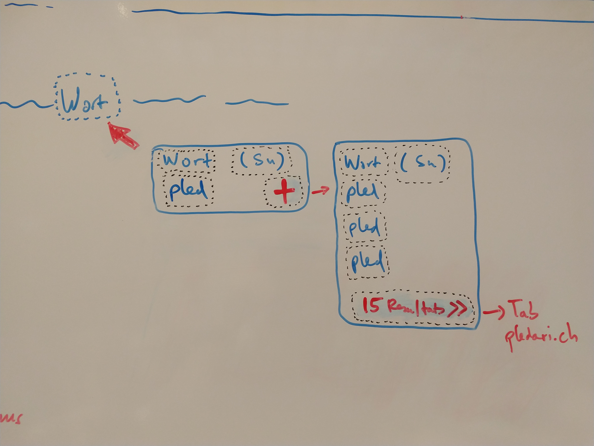

# hack.mypledari

*Project started at the [Forum Helveticum Hackathon](https://hack.opendata.ch/event/22), 23./24.11.2018*

Have a look at the [presentation](https://hack.opendata.ch/project/274/star)!

# Idea

Get a translation tooltip at your mouse pointer everywhere in the net. 

The tooltip accesses the database of [pledari.ch](http://pledari.ch), which offers translation between Rumantsch and the four languages German, French, Italian and English. Moreover, pledari.ch also offers translation from one ["idiom"](https://de.wikipedia.org/wiki/Idiom_(B%C3%BCndnerromanisch)) to another. 
Currently, the tooltip offers translation from Rumantsch (all "idioms") to German and from German to Rumantsch Grischun. A next iteration could also include translating from one "idiom" to another. 

# Implementation

The tooltip is implemented as Firefox plugin/extension. 

The plugin, if activated, adds a footer to any website to define the direction of translation. Next, the plugin tracks mouseover for words and directs a query to the database of pledari.ch, which returns exact matches based on the language selection made in the footer. Currently, the exact match is returned as a simple tooltip with a word. 

# Documentation / data

This repository includes...
* the data source as sql exports from the original database at pledari.ch
* the Chrome plugin
* the query helpers (php) hosted at pledari.ch, which allow access to the database

# Todo

- [ ] Finalize the design of the tooltip as sketched in Fig. 1
- [ ] Update the database behind pledari.ch to include all languages in one table
- [ ] Get from a prototype to a beta version which can be installed without programmer knowledge
- [ ] Implement for other browsers
- [ ] Add possibility to access the database behind [pledarigrond.ch](http://pledarigrond.ch) to extend the word source for Rumantsch Grischun

# Team

The people behind this project/prototype are:
* [sammy770](https://github.com/sammy770)
* [koluidi](https://github.com/koluidi)
* [sievilombriser](https://github.com/sievilombriser)
* [ocaduff](https://github.com/ocaduff)
* [hitgoeb](https://github.com/hitgoeb)
* [cdermont](https://github.com/cdermont)
* Karin Stephan
* Flurin Bundi

# A project initiated and supported by [Pro Svizra Rumantscha](http://rumantsch.ch)